<div align="center">

# 🐍 PunyPython

**Possessing prodigious potential for producing pragmatic and proficient Python programs.**

[](https://www.python.org/)
[](https://github.com/Quadstronaut/PunyPython)
[](LICENSE)

[](https://github.com/Quadstronaut/PunyPython/commits/master)
[](https://github.com/Quadstronaut/PunyPython)
[](https://github.com/Quadstronaut/PunyPython)

---

[](#about)
[](#structure)
[](#how-to-use)
[](#commenting-philosophy)
[](#attribution--license)
[](#contributing)

</div>

---

<a id="about"></a>

## 📖 About

PunyPython is a **Python-only** educational reference repository. Every file is a
runnable, heavily-commented script you can read, copy, paste, and experiment with.

| What | Details |
|---|---|
| 🎓 **Primary section** | `LearnXinY/` — structured transcription of the canonical [Learn X in Y Minutes — Python](https://learnxinyminutes.com/python/) guide (© its contributors, CC BY-SA 3.0), each topic expanded with up to two additional original examples per concept |
| 🤝 **Co-authored with** | [Claude](https://claude.ai) (Anthropic), original supplemental examples also released under CC BY-SA 3.0 |
| ⚙️ **Algorithm folders** | `Arrays/`, `Lists/`, `Textual/`, `Mathmatical/` — multiple approaches to common problems, side-by-side for trade-off comparison |
| 📜 **License** | Always Creative Commons. No proprietary content will ever be added. |

> [!NOTE]
> The `LearnXinY/` section is a structured transcription of the canonical
> [Learn X in Y Minutes — Python](https://learnxinyminutes.com/python/) guide
> (© its contributors, Creative Commons Attribution-ShareAlike 3.0 Unported).
> Each topic is expanded with up to two additional original examples per concept,
> co-authored with [Claude](https://claude.ai) (Anthropic), also released under CC BY-SA 3.0.

---

<a id="structure"></a>

## 🗂️ Repository Structure

```
PunyPython/
│
├── LearnXinY/                     ← Core language reference (learnxinyminutes transcription)
│   ├── Primitives/
│   │   ├── numbers.py             — integers, floats, arithmetic, operator precedence
│   │   ├── strings.py             — creation, slicing, methods, f-strings, translate
│   │   └── booleans_and_none.py   — bool ops, comparisons, short-circuit, truthiness
│   │
│   ├── Variables/
│   │   └── assignment.py          — basic assignment, unpacking, swap, augmented, annotations
│   │
│   ├── Collections/
│   │   ├── lists.py               — creation, indexing, slicing, mutation, methods
│   │   ├── tuples.py              — immutability, unpacking, namedtuple, memory
│   │   ├── dictionaries.py        — access, views, mutation, merge, Counter, defaultdict
│   │   └── sets.py                — operations, algebra, frozenset, deduplication
│   │
│   ├── ControlFlow/
│   │   ├── conditionals.py        — if/elif/else, ternary, match/case, guard clauses
│   │   ├── loops.py               — for, while, range, enumerate, zip, break/continue/else
│   │   ├── exceptions.py          — try/except/else/finally, raise, custom exceptions, with
│   │   └── comprehensions.py      — list, set, dict comprehensions; generator expressions
│   │
│   ├── Functions/
│   │   ├── basics.py              — def, return, scope, first-class, map/filter, lru_cache
│   │   ├── args_and_kwargs.py     — *args, **kwargs, keyword-only, positional-only, unpacking
│   │   ├── closures_and_lambdas.py — closures, nonlocal, lambda, operator module
│   │   ├── decorators.py          — @decorator, @wraps, arguments, stacking, class decorators
│   │   └── generators.py          — yield, generator expressions, yield from, send, pipelines
│   │
│   ├── Modules/
│   │   └── imports.py             — import, from/import, aliases, stdlib highlights, __name__
│   │
│   └── Classes/
│       ├── basics.py              — class, __init__, instance attrs, __str__/__repr__, dataclass
│       ├── properties_and_statics.py — @property, @classmethod, @staticmethod, cached_property
│       ├── inheritance.py         — single, multiple inheritance, super(), MRO, ABC, mixins
│       └── magic_methods.py       — arithmetic, comparison, container, context manager, __call__
│
├── Arrays/
│   ├── rotate/                    — 5 approaches to array rotation
│   ├── sum_of_array/              — 5 approaches to summing an array
│   └── largest_element/           — 6 approaches to finding the largest element
│
├── Lists/
│   └── swap_first_last/           — 4 approaches to swapping list ends
│
├── Textual/
│   ├── hello_world.py
│   ├── ascii_value_of_char.py     — print ASCII value of every character in user input
│   └── remove_nth_char.py         — remove the character at index n (0-based) from a string
│
├── Mathmatical/
│   ├── Armstrong_number_check.py
│   ├── factorial/                 — 4 approaches (one requires numpy: pip install numpy)
│   ├── maximum_of_2_numbers/      — 6 approaches
│   └── add_2_numbers/             — 6 approaches
│
└── venv_manager.py                — CLI tool for managing Python virtual environments
                                     (Unix-first; Windows-compatible with caveats — see script header)
```

### Folder Map at a Glance

```mermaid
graph TD
    ROOT["🐍 PunyPython"]

    ROOT --> LXY["📚 LearnXinY/\nCore language reference"]
    ROOT --> ARR["🔢 Arrays/\n5–6 approaches each"]
    ROOT --> LST["📋 Lists/\n4 approaches"]
    ROOT --> TXT["🔤 Textual/\n3 scripts"]
    ROOT --> MTH["➕ Mathmatical/\n4–6 approaches each"]
    ROOT --> VNV["⚙️ venv_manager.py\nCLI venv tool"]

    LXY --> PRI["Primitives\nnumbers · strings · booleans"]
    LXY --> VAR["Variables\nassignment"]
    LXY --> COL["Collections\nlists · tuples · dicts · sets"]
    LXY --> CFW["ControlFlow\nconditionals · loops · exceptions · comprehensions"]
    LXY --> FUN["Functions\nbasics · args · closures · decorators · generators"]
    LXY --> MOD["Modules\nimports"]
    LXY --> CLS["Classes\nbasics · properties · inheritance · magic_methods"]

    ARR --> AR1["rotate/ — 5 approaches"]
    ARR --> AR2["sum_of_array/ — 5 approaches"]
    ARR --> AR3["largest_element/ — 6 approaches"]

    MTH --> MT1["factorial/ — 4 approaches"]
    MTH --> MT2["maximum_of_2_numbers/ — 6 approaches"]
    MTH --> MT3["add_2_numbers/ — 6 approaches"]
    MTH --> MT4["Armstrong_number_check.py"]
```



---

<a id="how-to-use"></a>

## 🚀 How to Use

Each file in `LearnXinY/` is self-contained. Open any file and run it, or just read it —
all examples are written as expressions and print statements you can follow top to bottom.

```bash
python LearnXinY/Primitives/numbers.py
python LearnXinY/Collections/lists.py
python LearnXinY/Classes/inheritance.py
```

For the algorithm files, compare the approaches side by side to see the trade-offs
between readability, performance, and Python idiom.

> [!TIP]
> One approach in `Mathmatical/factorial/` requires NumPy. Install it first with:
> ```bash
> pip install numpy
> ```

---

<a id="commenting-philosophy"></a>

## 💬 Commenting Philosophy

The comment depth scales with topic complexity — purposely pedagogical, not pedantic:

| Level | Topics | Comments focus on… |
|---|---|---|
| 🟢 **Rudimentary** | Primitives, Variables | *What* each line does |
| 🟡 **Intermediate** | Collections, ControlFlow | *Why* a pattern is used, what pitfall it avoids (e.g. mutable default arguments, falsy-value traps) |
| 🔴 **Advanced** | Functions, Classes | *When* to reach for a technique and what its trade-offs are (e.g. when generators beat list comprehensions, when `__slots__` saves memory, how MRO cooperates in multiple inheritance) |

> [!IMPORTANT]
> The **Advanced** tier (Functions, Classes) is where the most educational density lives.
> Don't skip the comments — they're half the point.

---

<a id="attribution--license"></a>

## ⚖️ Attribution & License

<details>
<summary><strong>Full attribution details (click to expand)</strong></summary>

- Core examples transcribed from **[Learn X in Y Minutes — Python](https://learnxinyminutes.com/python/)**,
  © its contributors (Louie Dinh, Steven Basart, Andre Polykanine, and others).
  Licensed under [Creative Commons Attribution-ShareAlike 3.0 Unported (CC BY-SA 3.0)](https://creativecommons.org/licenses/by-sa/3.0/).

- Original supplemental examples (marked *co-authored with Claude* in each file)
  © quadstronaut & Claude (Anthropic), also released under CC BY-SA 3.0.

- Algorithm files in `Arrays/`, `Lists/`, `Textual/`, and `Mathmatical/` are original
  implementations by the repository contributors, released under CC BY-SA 3.0.

</details>

> [!IMPORTANT]
> This repository will **always** remain Creative Commons. No proprietary content will be added.

---

<a id="contributing"></a>

## 🤝 Contributing

This is a **Python-only** repository for educational purposes. Contributions that add new
Python examples, fix errors, or improve comments are welcome.

> [!NOTE]
> Please keep the same commenting style and CC BY-SA 3.0 license header in new files.
